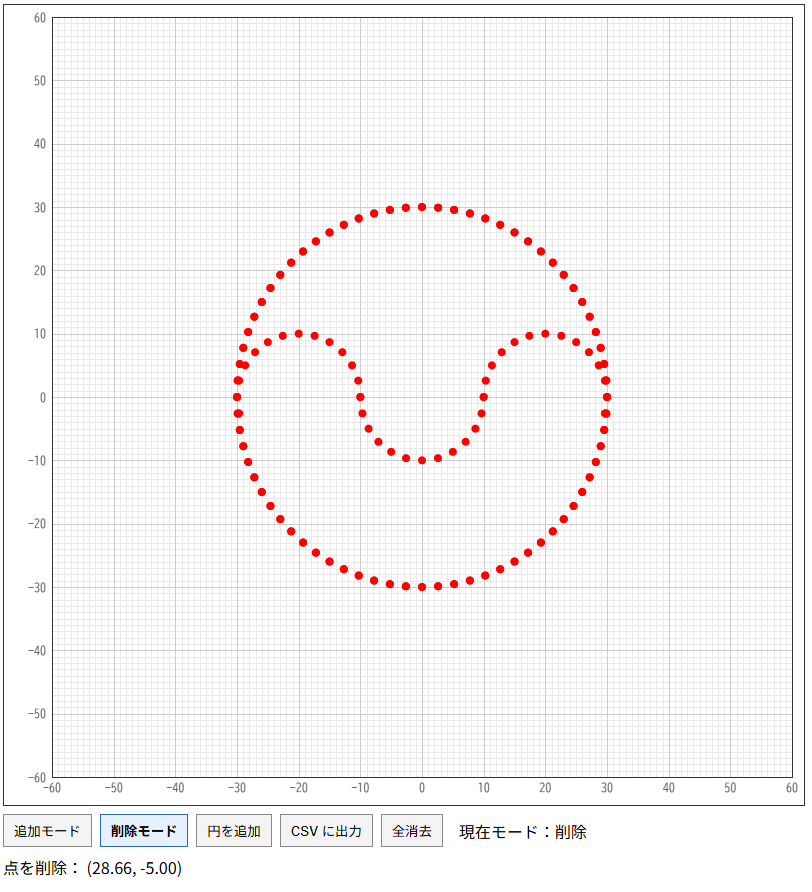

# vessel-surface-reconstruction

  

# useful libraries; VTK
https://examples.vtk.org/site/Cxx/VisualizationAlgorithms/TubesWithVaryingRadiusAndColors/
https://examples.vtk.org/site/Cxx/VisualizationAlgorithms/TubesFromSplines/
https://examples.vtk.org/site/Cxx/PolyData/TubeFilter/
